# Event Booking System — React Frontend

A web application for browsing events, booking seats, and managing event registrations. This project provides a React-based frontend integrated with a Laravel REST API.

## Overview

The Event Booking System provides separate interfaces for regular users and administrators.

The frontend was developed using React and Vite and communicates with the Laravel backend through REST API requests. It includes authentication, event browsing, seat booking, event management, and administrative monitoring features.

The original dashboard was built using Laravel Blade, and this project implements the frontend separately using React.

## Features

### User Features

- User registration and login
- Two-factor authentication (2FA) support
- Password recovery and reset
- Browse available events
- View event details
- Book event seats
- View personal bookings
- Manage account password

### Administrator Features

- Admin dashboard
- Create new events
- View and manage events
- Filter events by status:
  - Active
  - Registration Closed
  - Ended
  - Cancelled
- Cancel active events
- View event participants
- Review event logs
- Review login logs
- Change account password

### Frontend Features

- Light and dark mode support across application interfaces
- React functional components and hooks
- Client-side routing with React Router DOM
- API integration using Axios
- Protected routes and role-based navigation
- Form handling and validation feedback
- Loading, success, and error states
- Custom CSS styling
- Responsive layouts

## Technology Stack

| Technology | Purpose |
|---|---|
| React | User interface |
| Vite | Development server and build tooling |
| React Router DOM | Client-side navigation |
| Axios | HTTP requests to the backend API |
| CSS | Layout, styling, and responsive design |
| Laravel REST API | Backend integration |

## Screenshots

The following screenshots demonstrate the main interfaces and authentication workflows of the Event Booking System React frontend.

### Authentication and Security

#### Login with OTP

The login interface allows users to authenticate and access the system. The authentication workflow supports an additional verification step when two-factor authentication is enabled.

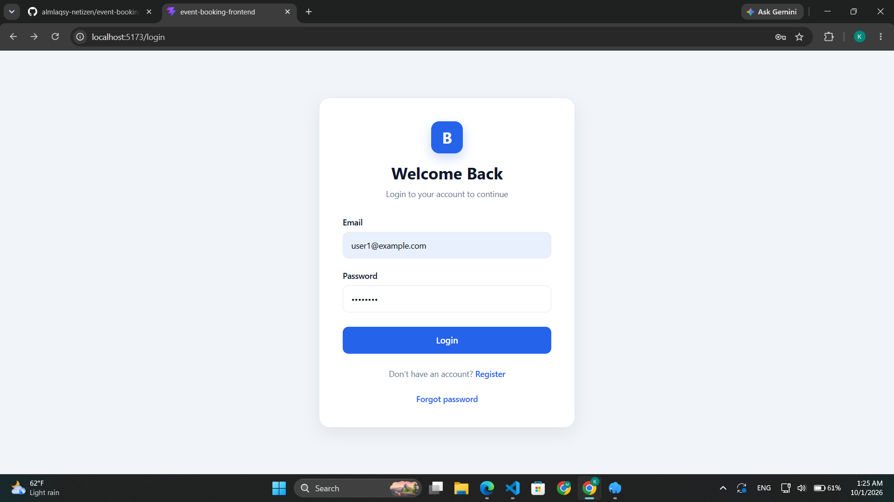

#### Two-Factor Authentication Setup

For users setting up two-factor authentication for the first time, the system displays a QR code that can be scanned using a compatible authenticator application.

The authenticator application can then be used to generate verification codes during the authentication process.

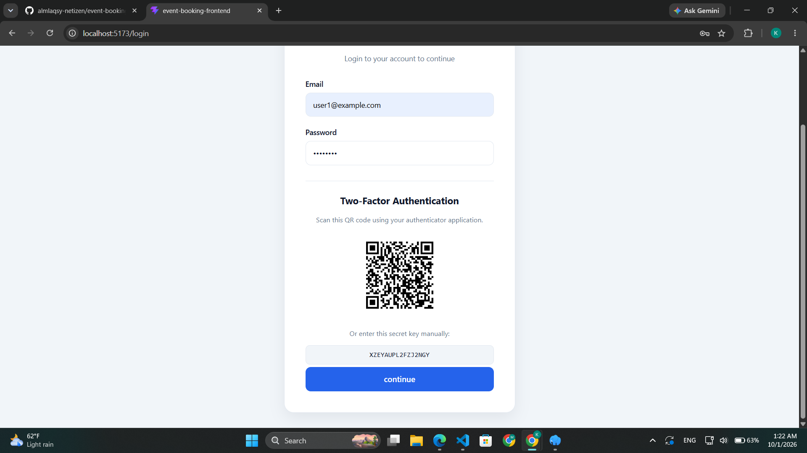

#### User Registration

New users can create an account by providing their required registration information.

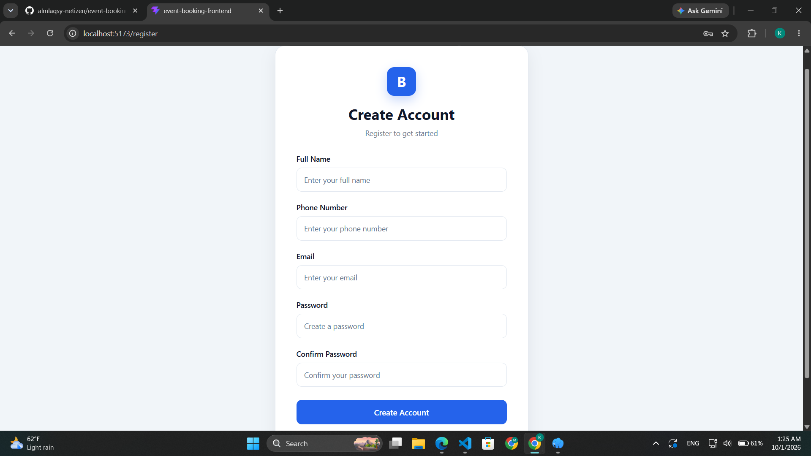

#### Password Reset

Users can access the password reset workflow when they need to recover access to their accounts.

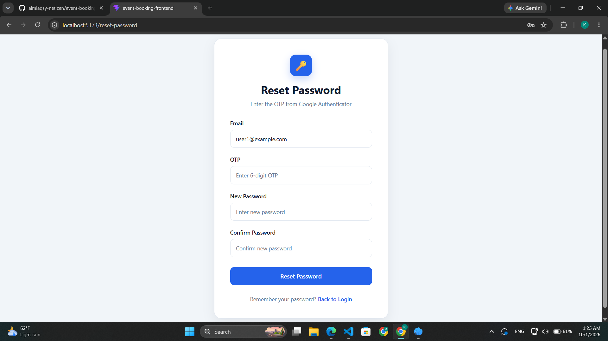

### User Interface

#### User Dashboard

The dashboard provides users with an overview of their account and access to the event booking features.

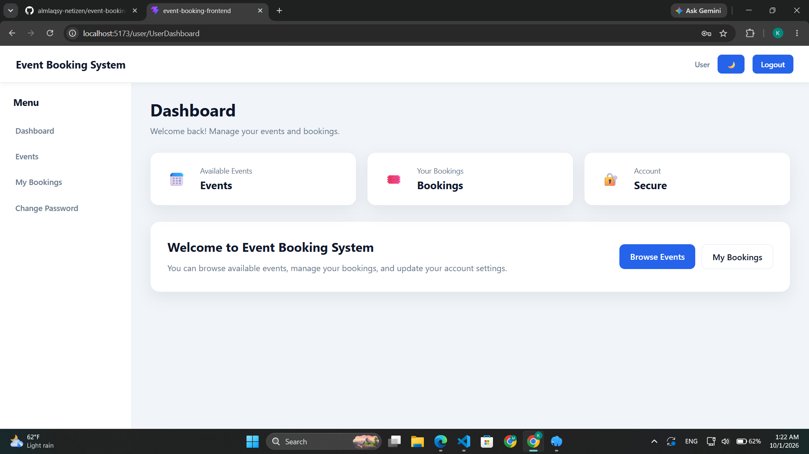

#### Event Booking

Users can browse event information and proceed through the seat booking workflow.

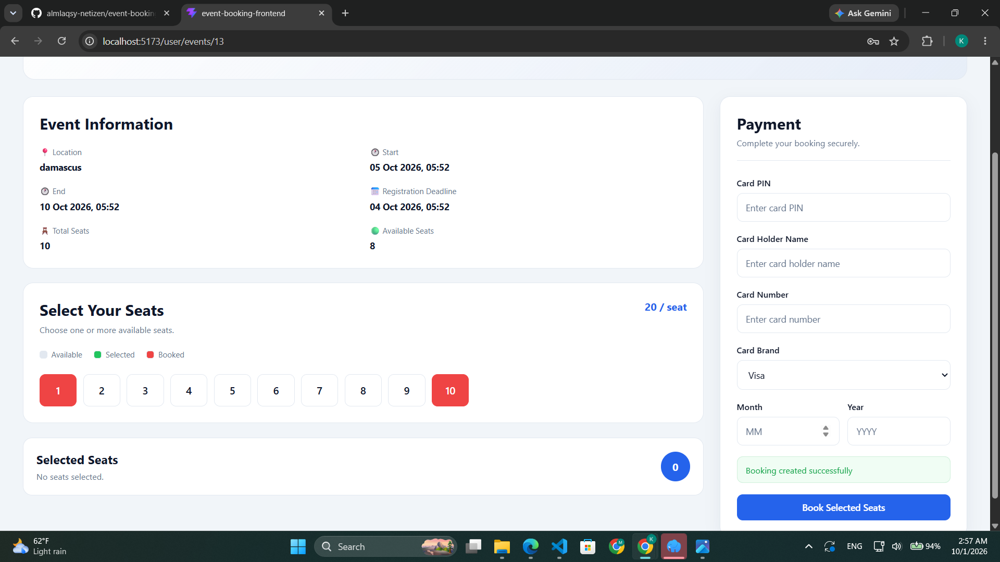

#### My Bookings

Users can review their existing bookings through a dedicated page.

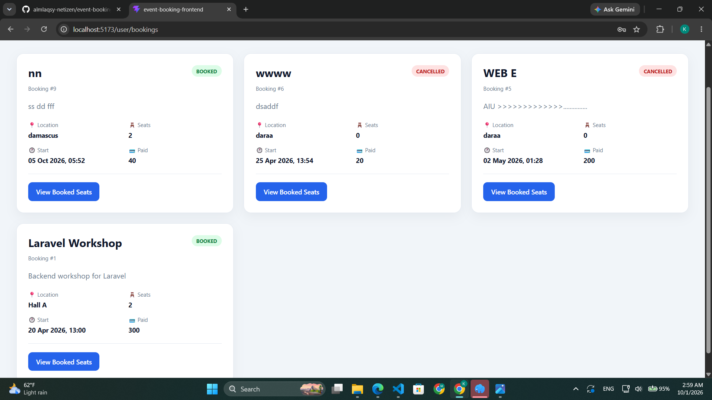

### Administrator Interface

#### Create Event

Administrators can create new events by entering the event details, schedule, registration deadline, seat capacity, and price.

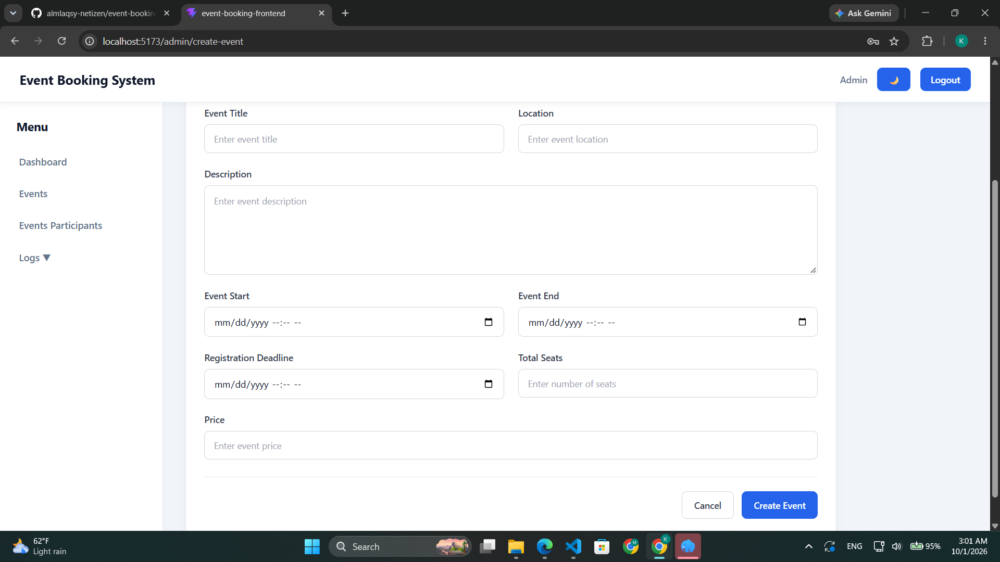

#### Event Management

Administrators can view and manage events, including filtering them by status and cancelling active events.

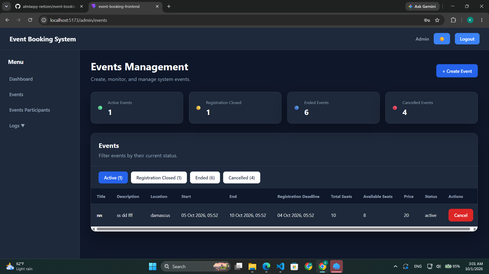

#### Event Participants

Administrators can review the participants associated with events.

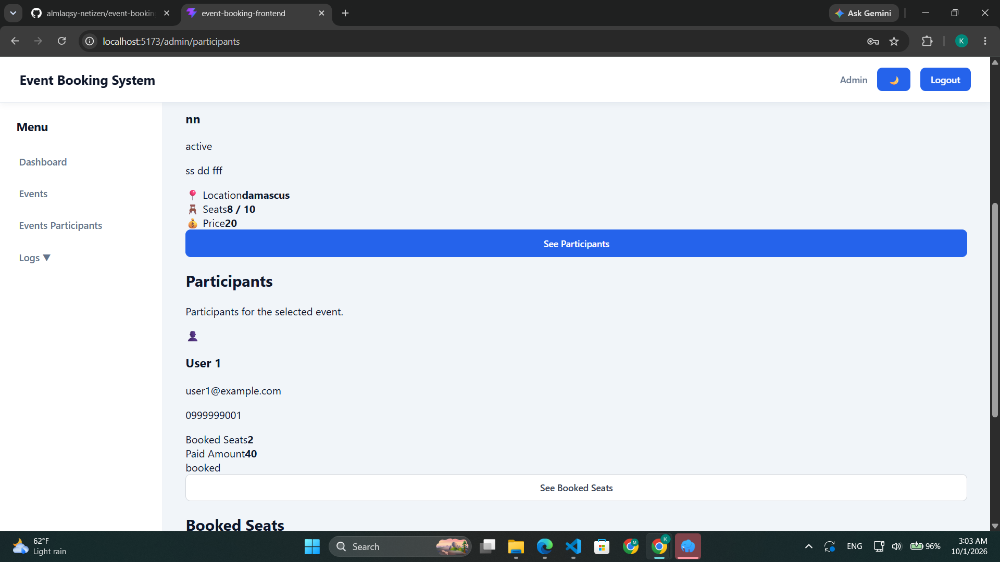

#### Event Logs

The administration interface provides access to event-related logs for monitoring system activity.

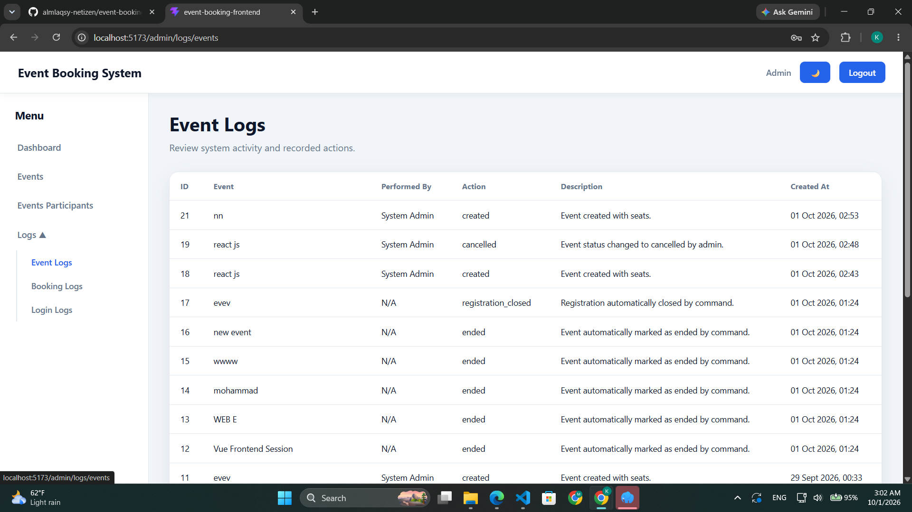

#### Login Logs

Login logs provide a view of recorded authentication activity.

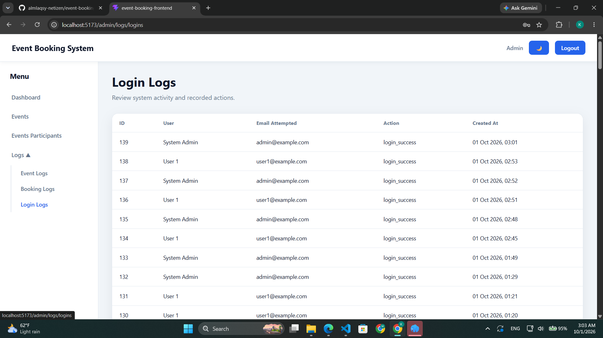

## Getting Started

### Prerequisites

Before running the project, ensure that you have installed:

- Node.js
- npm
- A running instance of the Laravel backend

### Installation

#### 1. Clone the Repository

```bash
git clone https://github.com/almlaqsy-netizen/event-booking-frontend.git
```

#### 2. Navigate to the Project Directory

```bash
cd event-booking-frontend
```

#### 3. Install Dependencies

```bash
npm install
```

#### 4. Configure the Backend API

Open the Axios configuration file:

```text
src/api/axios.js
```

Configure the API base URL to point to your running Laravel backend.

For local development, the URL may look like this:

```text
http://127.0.0.1:8000/api
```

Ensure that the backend is running and that the API endpoints are accessible.

#### 5. Start the Development Server

```bash
npm run dev
```

#### 6. Open the Application

Open the local URL displayed in your terminal. The default Vite development URL is usually:

```text
http://localhost:5173
```

## Development Commands

### Run the Development Server

```bash
npm run dev
```

### Build for Production

```bash
npm run build
```

### Preview the Production Build

```bash
npm run preview
```

## Backend Integration

This frontend depends on the Laravel REST API for authentication, event management, bookings, and other application operations.

The backend is responsible for data persistence, business logic, and server-side authorization.

**Backend Repository:** [Add your Laravel backend repository URL here]

## Project Structure

```text
event-booking-frontend/
├── public/
│   └── screenshots/
│       ├── authentication/
│       ├── user/
│       └── admin/
├── src/
│   ├── api/
│   │   └── axios.js
│   ├── components/
│   ├── pages/
│   │   ├── admin/
│   │   └── user/
│   ├── styles/
│   ├── App.jsx
│   └── main.jsx
├── package.json
├── index.html
└── README.md
```

## Notes

- The frontend requires the Laravel backend for API-dependent functionality.
- Authentication and authorization depend on the backend API and the frontend's route protection.
- Configure the API base URL before running the application.
- Do not commit passwords, API secrets, access tokens, or other sensitive configuration values to the repository.

## Author

**Kusai Almanla**

AI Engineering Graduate | React Developer

GitHub: [@almlaqsy-netizen](https://github.com/almlaqsy-netizen)
